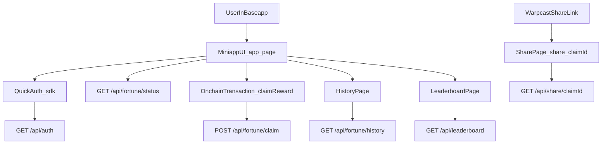

# Based Cookie Miniapp — спецификация эндпоинтов

## 1. Введение

Этот документ описывает API‑слой мини‑аппа **Based Cookie**:

- какие эндпоинты существуют (или планируются);
- какие структуры данных они принимают и возвращают;
- как они связаны с фронтендом и ончейн‑частью.

Файл служит **источником правды** при изменении кода эндпоинтов и клиентских вызовов.

Связанные ключевые файлы:

- Основной UI: `app/page.tsx`
- Глобальные провайдеры: `app/rootProvider.tsx`
- Контракт и клейм‑логика: `app/contract.ts`
- Paymaster и конфиг: `app/paymaster.ts`
- Текущий эндпоинт авторизации Farcaster: `app/api/auth/route.ts`

## 2. Общие принципы

- **Версионирование**  
  - Текущее API считается **v1** и не использует версионный префикс в URL.  
  - При ломающих изменениях контрактов (изменение формата запросов/ответов, удаление полей) версию следует повысить (например, ввести `/api/v2/...`) и обновить этот документ.

- **Аутентификация**
  - Все защищённые эндпоинты используют **Farcaster JWT**, полученный через Mini App Quick Auth.
  - На клиенте запросы к приватным эндпоинтам должны выполняться через `sdk.quickAuth.fetch`, чтобы автоматически проставлять заголовок `Authorization: Bearer <jwt>`.

- **Ошибки**
  - Базовые коды:
    - `401 Unauthorized` — отсутствует или невалидный токен.
    - `403 Forbidden` — пользователь аутентифицирован, но не имеет права выполнить действие (если потребуется).
    - `400 Bad Request` — неконсистентные или невалидные данные запроса.
    - `500 Internal Server Error` — внутренняя ошибка сервера.
  - Формат тела ошибки:

```ts
type ApiError = {
  message: string;
  code?: string; // опциональный машинный код, если нужно различать типы ошибок
};
```

## 3. Модели данных

Ниже описаны логические модели, используемые в API. Это **не** привязка к конкретной БД, а контракты между бекендом и фронтендом.

```ts
// Уникальный пользователь (по Farcaster FID + адресу кошелька)
export type UserId = {
  fid: number;            // Farcaster ID
  address: `0x${string}`; // EVM‑адрес пользователя
};

export type FortuneRarity = 'common' | 'rare' | 'legendary';

// Каталог всех возможных форчун
export interface FortuneDefinition {
  id: string;              // стабильный ID фортуны (например, "base_pump_v1")
  text: string;            // текст предсказания
  rarity: FortuneRarity;   // редкость
  createdAt: string;       // ISO‑дата создания записи
}

// Одна запись о клейме / выдаче фортуны пользователю
export interface FortuneClaim {
  id: string;              // UUID/уникальный ID записи
  user: UserId;
  fortuneId: string;       // ссылка на FortuneDefinition.id
  claimedAt: string;       // ISO‑время клейма
  txHash?: `0x${string}`;  // хеш ончейн‑транзакции при наличии
}

// Агрегированная статистика по пользователю (для лидерборда и профиля)
export interface UserStats {
  user: UserId;
  totalClaims: number;       // всего клеймов
  rareClaims: number;        // клеймов редких форчун
  legendaryClaims: number;   // клеймов легендарных форчун
  lastClaimAt?: string;      // время последнего клейма
  bestStreakDays: number;    // максимальный дневной стрик за всё время
  currentStreakDays: number; // текущий дневной стрик
}

// Текущий статус фортуны и клеймов для пользователя
export interface FortuneStatus {
  user: UserId;
  todaysFortune: FortuneDefinition; // "ежедневная" фортуна
  todaysFortuneAssignedAt: string;  // когда фортуна была назначена (ISO)
  lastClaimAt?: string;            // последний клейм, если был
  nextClaimAvailableAt?: string;   // когда можно делать следующий клейм
  isCooldownActive: boolean;       // активен ли кулдаун
  remainingCooldownMs: number;     // оставшееся время кулдауна в мс
}
```

## 4. Эндпоинты

Каждый эндпоинт описывается по шаблону:  
**Назначение → Маршрут и метод → Аутентификация → Параметры → Формат ответа → Ошибки → Связь с фронтом**.

### 4.1. `GET /api/auth`

- **Назначение**  
  Верифицировать Farcaster JWT и вернуть `userFid`.

- **Маршрут и метод**  
  `GET /api/auth`

- **Аутентификация**  
  - Заголовок `Authorization: Bearer <jwt>`.
  - JWT должен поступать из Mini App Quick Auth, когда запрос вызывается через `sdk.quickAuth.fetch`.

- **Параметры запроса**
  - Тело: отсутствует.
  - Query‑параметров нет.

- **Формат ответов**

```ts
// 200 OK
{
  userFid: number;
}

// 401 Unauthorized
{
  message: 'Missing token' | 'Invalid token';
}

// 500 Internal Server Error
{
  message: string;
}
```

- **Ошибки и инварианты**
  - При отсутствии или неправильном формате заголовка `Authorization` возвращается `401` с `message: "Missing token"`.
  - При невалидном токене (`InvalidTokenError`) возвращается `401` с `message: "Invalid token"`.

- **Связь с фронтом**
  - Базовый строительный блок для всех остальных эндпоинтов.  
  - Логику валидации токена целесообразно вынести в общий helper, чтобы переиспользовать её в других маршрутах (`/api/fortune/*` и т.д.).

---

### 4.2. `GET /api/fortune/status`

- **Назначение**  
  Вернуть персонализированный статус фортуны и клеймов для текущего пользователя: его ежедневную фортуне, кулдаун и основные показатели.

- **Маршрут и метод**  
  `GET /api/fortune/status`

- **Аутентификация**
  - Такой же Farcaster JWT, как в `/api/auth`, через `Authorization: Bearer <jwt>`.

- **Параметры запроса**
  - Query:
    - `address: 0x...` — обязательный адрес пользователя (из `useAccount` / OnchainKit).
  - Тело отсутствует.

- **Формат ответа**

```ts
// 200 OK
{
  status: FortuneStatus;
}
```

- **Особенности и инварианты**
  - **Детерминированная ежедневная фортуна**:
    - Для каждой пары `(fid, date)` (где `date` — день в UTC или в выбранной таймзоне) назначается одна и та же фортуна.
    - Реализация может использовать хэш от строки `"fid:date"` и маппинг на список `FortuneDefinition`.
  - **Кулдаун**:
    - На основе истории клеймов определяется `lastClaimAt` и `nextClaimAvailableAt`.
    - `isCooldownActive` и `remainingCooldownMs` считаются на момент запроса.
  - **Streak**:
    - `currentStreakDays` и `bestStreakDays` рассчитываются по последовательности ежедневных клеймов.

- **Типичные ошибки**
  - `401` — при проблемах с JWT.
  - `400` — при отсутствии или невалидности параметра `address`.

- **Связь с фронтом**
  - Рекомендуется вызывать в `app/page.tsx` после получения:
    - `userFid` (через `/api/auth` / quickAuth).
    - `address` (через `useAccount` / OnchainKit).
  - Статус из этого эндпоинта может использоваться для:
    - синхронизации кулдауна на клиенте;
    - отображения сегодняшней фортуны вместо чисто случайного выбора;
    - отображения статистики (streak, редкость и т.д.).

---

### 4.3. `POST /api/fortune/claim`

- **Назначение**  
  Зафиксировать факт успешного клейма фортуны на сервере и вернуть обновлённый статус и статистику пользователя.

- **Маршрут и метод**  
  `POST /api/fortune/claim`

- **Аутентификация**
  - Farcaster JWT в заголовке `Authorization: Bearer <jwt>`.

- **Тело запроса**

```ts
{
  address: `0x${string}`; // адрес, совершивший клейм
  fortuneId: string;      // ID выданной/сегодняшней фортуны
  txHash?: `0x${string}`; // хеш ончейн‑транзакции (если есть)
  claimedAt?: string;     // ISO‑время клейма; если не задано — сервер может подставить текущее
}
```

- **Формат ответа**

```ts
// 200 OK
{
  claim: FortuneClaim;
  updatedStatus: FortuneStatus;
  updatedStats: UserStats;
}
```

- **Ошибки и инварианты**
  - `400 Bad Request`:
    - если клейм совершается во время активного кулдауна;
    - если `fortuneId` не существует или не соответствует сегодняшней фортуне пользователя.
  - `401/403` — при проблемах с аутентификацией/авторизацией.
  - Дополнительно можно использовать поле `code` в теле ответа (`ApiError`) для различения:
    - `"COOLDOWN_ACTIVE"`;
    - `"INVALID_FORTUNE_ID"`;
    - `"DUPLICATE_CLAIM"` и т.п.

- **Связь с фронтом**
  - Рекомендуемое место вызова — в `app/page.tsx` внутри `handleTxStatus`, когда:
    - `status.statusName === 'success'`;
    - известен `txHash` транзакции.
  - После успешного ответа можно:
    - обновлять локальный кулдаун и нотификации;
    - отображать редкость фортуны и streak из `updatedStatus` / `updatedStats`.

---

### 4.4. `GET /api/fortune/history`

- **Назначение**  
  Вернуть историю клеймов для текущего пользователя (для страницы истории/профиля).

- **Маршрут и метод**  
  `GET /api/fortune/history`

- **Аутентификация**
  - Farcaster JWT через `Authorization: Bearer <jwt>`.

- **Параметры запроса**
  - Query:
    - `address: 0x...` — адрес пользователя (обязателен).
    - `limit?: number` — количество записей на страницу (по умолчанию, например, 50).
    - `offset?: number` — смещение для пагинации.

- **Формат ответа**

```ts
// 200 OK
{
  items: Array<FortuneClaim & { fortune: FortuneDefinition }>;
  total: number;
  hasMore: boolean;
}
```

- **Типичные ошибки**
  - `401` — проблемы с аутентификацией.
  - `400` — некорректные значения `address`, `limit`, `offset`.

- **Связь с фронтом**
  - Используется страницей `app/history/page.tsx` (или аналогичной) для:
    - отображения списка форчун, дат клейма и редкости;
    - построения локальной статистики пользователя.

---

### 4.5. `GET /api/leaderboard`

- **Назначение**  
  Вернуть лидерборд по пользователям на основе разных метрик.

- **Маршрут и метод**  
  `GET /api/leaderboard`

- **Аутентификация**
  - Может быть как публичным, так и защищённым (решается по требованиям продукта).  
  - Базовый вариант: публичный эндпоинт без обязательного JWT.

- **Параметры запроса**
  - Query:
    - `metric: 'totalClaims' | 'rareClaims' | 'legendaryClaims'` — ключевая метрика.
    - `limit?: number` — максимальное количество позиций (по умолчанию, например, 100).

- **Формат ответа**

```ts
// 200 OK
{
  metric: string;
  items: Array<{
    user: UserId;
    rank: number;   // позиция в лидерборде (1-based)
    stats: UserStats;
  }>;
}
```

- **Ошибки**
  - `400` — при невалидном значении `metric` или `limit`.

- **Связь с фронтом**
  - Используется страницей `app/leaderboard/page.tsx`:
    - вкладки/переключатели по метрикам;
    - таблица/список пользователей с FID/адресом и ключевыми показателями.

---

### 4.6. `GET /api/share/[claimId]`

- **Назначение**  
  Отдать публичные данные по конкретному клейму для share‑страницы и OG‑картинки.

- **Маршрут и метод**  
  `GET /api/share/[claimId]`

- **Аутентификация**
  - Эндпоинт обычно **публичный**, чтобы им могли пользоваться внешние клиенты (Warpcast, превью‑боты).

- **Параметры запроса**
  - Параметр пути:
    - `claimId: string` — ID записи о клейме.

- **Формат ответа**

```ts
// 200 OK
{
  claim: {
    id: string;
    fortune: FortuneDefinition;
    user: { fid: number }; // адрес может опускаться по privacy‑соображениям
    claimedAt: string;
  };
}
```

- **Ошибки**
  - `404 Not Found` — если клейм с таким `claimId` не найден или недоступен.

- **Связь с фронтом**
  - Используется страницей `app/share/[claimId]/page.tsx`:
    - для отрисовки конкретной фортуны (текст, редкость, базовый контекст пользователя);
    - для генерации OG‑картинок и метаданных (через динамический `generateImage` или `ImageResponse`).
  - Ссылки на эту страницу можно вкладывать в Warpcast посты при шаринге из мини‑аппа.

## 5. Диаграмма потока запросов

Ниже — общий поток взаимодействия пользователя с мини‑аппом и API.



## 6. Правила использования и поддержки

- **При добавлении или изменении эндпоинта**
  - Обязательно обновлять соответствующий раздел в `docs/miniapp-endpoints.md`.
  - Для ломающих изменений (смена формата, удаление полей) явно фиксировать это в тексте и при необходимости повышать версию API.

- **При работе над фронтом**
  - Перед интеграцией с эндпоинтом сверяться с разделом «Формат ответа» и «Связь с фронтом».
  - При любых расхождениях между реализацией и этим документом приоритет за документом, пока не будет принято и задокументировано обновление.

- **Тестирование**
  - На основе описаний эндпоинтов можно формировать коллекции Postman/Thunder Client и e2e‑тесты.
  - При добавлении новых полей/логики рекомендовано дополнять тесты, опираясь на модели и примеры из этого файла.

